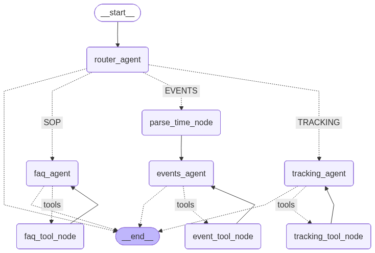
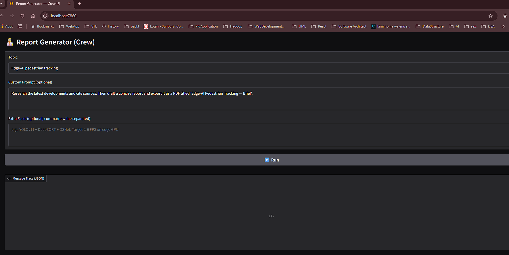
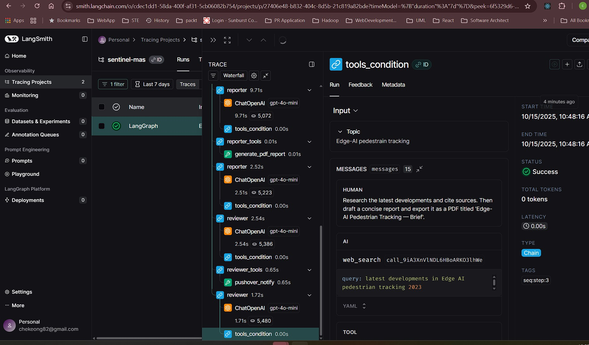
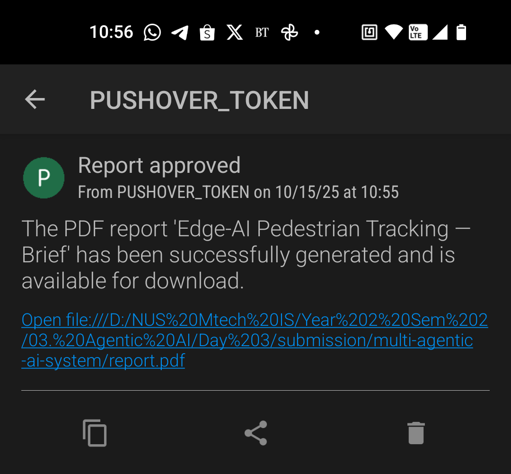

# Report Generator 
## Graph workflow


## App UI


## Integration with Langsmith


## Integraiton with Pushover


## 🧩 Tech Stack

- **Python 3.12+**
- **LangGraph** for stateful orchestration
- **LLM** via your chosen provider (e.g., OpenAI)  
- **Tavily** (`TAVILY_API_KEY`) for web search
- **Gradio** for UI
- **reportlab** for PDF
- **LangSmith** (optional) for tracing: `LANGSMITH_TRACING=true`
- **Pushover** for notifications

---

## 🔧 Setup
### 1) Install dependencies
```bash
uv init --python 3.12
uv venv .venv
source .venv/bin/activate   # Windows: .venv\Scripts\activate
uv add -r requirements.txt
```

### 2) Run app with cli
```bash
uv run app.py
```

### 3) Run app with UI
~~~bash
uv run app_ui.py
~~~

# create & store kb
uv run ./scripts/create_kb.py --kb sentinel_mas/kb/sentinel_sop_kb.jsonl 

# query kb
uv run ./scripts/query_kb.py --query "How to escalate level-2 anomaly"